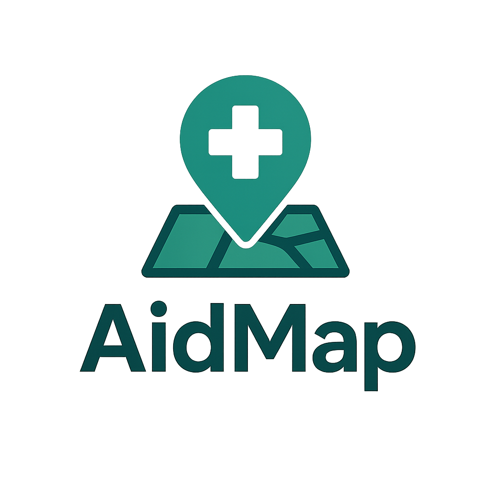

<p align="center">
  <a href="https://aidmap.live/">
    
  </a>
</p>

<h1 align="center">AidMap</h1>

<p align="center">
  Crowdsourced locations of first-aid kits, AEDs, and other emergency supplies.
</p>

<p align="center">
  <a href="https://aidmap.live/"></a>
  <a href="https://github.com/dankeg/AidMap/actions"></a>
  <a href="https://github.com/dankeg/AidMap/issues"></a>
  <a href="https://github.com/dankeg/AidMap/pulls"></a>
  <a href="https://img.shields.io/badge/python-3.11%2B-blue"></a>
  <a href="https://flask.palletsprojects.com/"></a>
  <a href="#"></a>
</p>

---

AidMap is a lightweight Flask application that lets communities crowdsource the locations of critical emergency resources—like first-aid kits, AEDs, and general emergency kits—onto an interactive Mapbox map. Submissions can include photos, are vetted via a built-in moderator workflow with optional two-factor authentication, and can be upvoted to highlight the most useful entries.

- **Live site:** [aidmap.live](https://aidmap.live/)
- **Tech:** Python + Flask, SQLite, Mapbox GL JS  
- **Topics:** crowdsourcing, emergency-response, first aid, mapping

---

## 📚 Contents
- [Features](#features)
- [Quickstart](#quickstart)
- [Configuration](#configuration)
- [API](#api)
- [Data Model](#data-model)
- [Frontend and Resource Types](#frontend-and-resource-types)
- [Deployment](#deployment)
- [Security Notes](#security-notes)
- [Contributing](#contributing)
- [Roadmap](#roadmap)
- [Acknowledgments](#acknowledgments)
- [License](#license)

---

## 🧩 Features
### Crowdsourced Submissions
- Users submit latitude/longitude, resource type, description, and optional image (PNG/JPEG).

### Moderator Workflow
- Password-based moderator login with optional TOTP 2FA (Google Authenticator compatible).
- Approve or reject pending submissions.

### Voting
- Simple per-browser voting with lookback window to reduce repeat votes.

### Map-based UI
- Mapbox-powered interactive map showing approved resources, colored by type.

### Configurable Resource Categories
- Update labels and colors in a JSON file without code changes.

### Sensible Defaults & Security
- Strict content security policy, file size limits, MIME checks, and session scoping.

---

## ⚡ Quickstart

### Prerequisites
- Python 3.11+
- A Mapbox access token: [account.mapbox.com](https://account.mapbox.com/)

### Local Run
Clone and install:
```bash
git clone https://github.com/dankeg/AidMap.git
cd AidMap
python -m venv .venv && source .venv/bin/activate
pip install -r requirements.txt
```

Set environment:
```bash
export MAPBOX_TOKEN="pk.your-mapbox-token"
# Optional but recommended for local moderation:
export ADMIN_USERNAME="admin"
export ADMIN_PASSWORD="choose-a-strong-password"
# Optional: bootstrap credentials path
# export ADMIN_BOOTSTRAP_PATH="$PWD/temp_credentials.txt"
```

Start the app:
```bash
python app.py
# or with Gunicorn (recommended for prod-like runs)
gunicorn -c gunicorn_config.py app:app
```

Open [http://127.0.0.1:5000](http://127.0.0.1:5000)

---

## ⚙️ Configuration

### Environment Variables

| Variable | Required | Description |
|-----------|-----------|-------------|
| `MAPBOX_TOKEN` | ✅ | Mapbox access token used by frontend |
| `ADMIN_USERNAME` | ❌ (default: `admin`) | Moderator username |
| `ADMIN_PASSWORD` | ❌ | If unset, random credentials are generated |
| `ADMIN_BOOTSTRAP_PATH` | ❌ (default: `temp_credentials.txt`) | File to store bootstrap credentials |

Other in-code defaults:
- `MAX_CONTENT_LENGTH = 16MB`
- `SESSION lifetime = 2 hours`
- Allowed MIME types: `image/jpeg`, `image/jpg`, `image/png`

### Moderator 2FA (TOTP)
- If `ADMIN_PASSWORD` is unset on first run, one-time credentials and a new TOTP secret are generated.
- If set, moderators can enable 2FA via the moderator UI.

---

## 🧠 API

### Public Endpoints
| Method | Route | Description |
|---------|--------|-------------|
| `GET` | `/api/submissions` | Returns approved submissions |
| `GET` | `/api/submissions/{id}/image` | Returns base64 image + MIME type |
| `POST` | `/api/submit` | Submit new location (multipart/form-data) |
| `POST` | `/api/vote/{submission_id}` | One vote per browser (30-day window) |

### Moderator Endpoints
| Method | Route | Description |
|---------|--------|-------------|
| `POST` | `/api/moderator/login` | Login, returns 2FA flag |
| `POST` | `/api/moderator/login/totp` | Verify TOTP |
| `POST` | `/api/moderator/logout` | Logout moderator |
| `GET` | `/api/moderator/pending` | List pending submissions |
| `POST` | `/api/moderator/approve/{id}` | Approve submission |
| `POST` | `/api/moderator/reject/{id}` | Reject (delete) submission |

---

## 🗃️ Data Model
- SQLite database at `instance/medical_supplies.db`
- Schema: see [`schema.sql`](schema.sql)

**Tables**
- `submissions`: entries with `status`, `votes`, `timestamps`, optional image blob
- `votes`: unique `(submission_id, vote_token)` with 30-day enforcement
- `moderators`: username, password hash, optional TOTP secret

**Reset Database**
```bash
rm instance/medical_supplies.db
python app.py
```

---

## 🗺️ Frontend and Resource Types
- Map UI uses `MAPBOX_TOKEN`.
- Resource categories are defined in [`static/data/resource_types.json`](static/data/resource_types.json):

```json
{
  "value": "first_aid",
  "label": "First Aid Kit",
  "markerColor": "#FF0000",
  "badgeBackground": "#FFF",
  "badgeColor": "#000"
}
```

Restart the app after edits. Submissions are validated against these entries.

---

## 🚀 Deployment

### WSGI (Gunicorn)
```bash
gunicorn -c gunicorn_config.py app:app
```

### Reverse Proxy & TLS
- Place Gunicorn behind Nginx/Apache/Caddy.
- Enforce HTTPS and caching.

### Persistent Storage
- Ensure `instance/` is writable for SQLite.
- For scaling, migrate to a managed RDBMS.

### Environment
- Provide secrets securely.
- Rotate moderator credentials periodically.

---

## 🔒 Security Notes
- Use strong moderator credentials.
- Enable and store TOTP secrets securely.
- CSP, X-Frame-Options, and similar headers are enforced.
- Uploads restricted to PNG/JPEG ≤16MB.
- Votes are tokenized, not authenticated.

---

## 🤝 Contributing
We welcome contributions that improve accessibility, data quality, and moderation UX.

1. Open an issue for bugs or proposals.
2. Fork → Branch → PR with clear description.
3. Keep PRs focused and small.
4. Include before/after screenshots for UI changes.
5. Add tests where possible.

---

## 🧭 Roadmap
- Optional user accounts for trusted contributors  
- Map filters and search  
- Additional resource types and localization  
- Export/backup tooling  
- Rate-limiting and spam prevention  
- CI, tests, and coverage  

---

## 🙏 Acknowledgments
- Map rendering by [Mapbox](https://www.mapbox.com/).  
- Thanks to the open-source community for the Flask + mapping ecosystem.

---

## 📄 License
This project’s license is **TBD**.  
Add a `LICENSE` file (e.g., MIT/Apache-2.0) and update the badge when chosen.

---

### 🔗 Project Meta
- **Repository:** [github.com/dankeg/AidMap](https://github.com/dankeg/AidMap)  
- **Branch:** `main`  
- **Homepage:** [aidmap.live](https://aidmap.live/)
